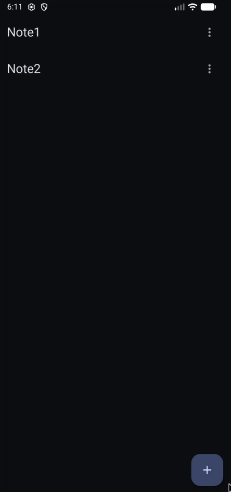

# 🗒️ Cleanote

A simple Android application that allows users to **create, view, edit, and delete notes**, storing them locally on the device.  
The main focus of this project is not on UI design, but on demonstrating **Clean Architecture**, **SOLID principles**, and **best coding practices** for scalable Android development.

---

## 🚀 Features

- ✏️ Create new notes
- 🗂️ View a list of saved notes
- 🧾 Edit or delete existing notes
- 💾 Local data persistence using Room
- 🔄 Reactive UI updates via Flow
- 🧱 Structured following Clean Architecture principles

---

## 🛠️ Tech Stack

- **Language:** Kotlin
- **Architecture:** Clean Architecture + MVVM
- **Database:** Room
- **Async:** Kotlin Coroutines, Flow
- **Dependency Injection:** Hilt
- **UI:** Jetpack Compose

---

## 📱 Demo

---

## 🧪 Testing

- Unit testing for ViewModel
- UI testing with Jetpack Compose Testing

---

## 🧼 Code Principles Highlighted

- Single Responsibility Principle
- Separation of Concerns
- Dependency Inversion
- Interface-driven Design
- Clear Data Flow between layers
- Scalable, testable, and maintainable codebase

---
